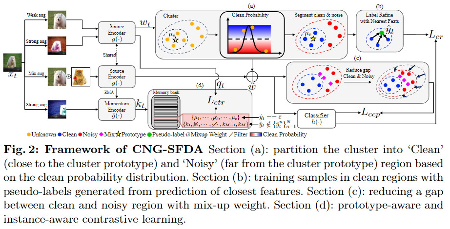

This repo is followed by https://github.com/DianCh/AdaContrast

# CNA-TTA: Clean and Noisy Aware Feature Learning within Clusters for Online-Offline Test-Time Adaptation 



## Installation
To use the repository, we provide a Docker container based on conda environment. Please, use the blew Make command for setup envirnoment.
```bash
Make env
Make over
Make build
Make exec
```

## Prepare dataset
We download [VisDA-C](https://github.com/VisionLearningGroup/taskcv-2017-public/tree/master/classification), [DomainNet(cleaned version)](http://ai.bu.edu/M3SDA/), and [PACS](https://drive.google.com/drive/folders/0B6x7gtvErXgfUU1WcGY5SzdwZVk?resourcekey=0-2fvpQY_QSyJf2uIECzqPuQ).

To preprocess dataset, we follow same as in [AdaContrast](https://github.com/DianCh/AdaContrast).


## Source Training
To train a source model on each dataset, you can run bash files in src_${dataset} folder.

### Single-Source settting
```bash
bash train_${dataset}_source.sh
```

### Multi-Source setting
```bash
bash train_${dataset}_source_MSDA.sh
```


## Adpatation for Target
For adaptation for target, you can run bash files in src_${dataset} folder.

### Offline TTA in Single-Source settting
```bash
bash train_${dataset}_target_offline.sh
```

### Online TTA in Single-Source settting
```bash
bash train_${dataset}_target_online.sh
```

### Offline TTA in Multi-Source setting
```bash
bash train_${dataset}_target_MSDA_offline.sh
```

### Online TTA in Multi-Source setting
```bash
bash train_${dataset}_target_MSDA_online.sh
```